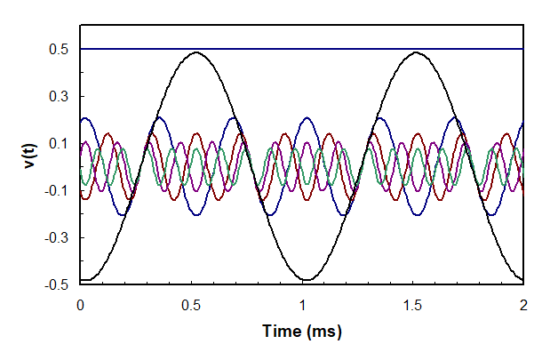
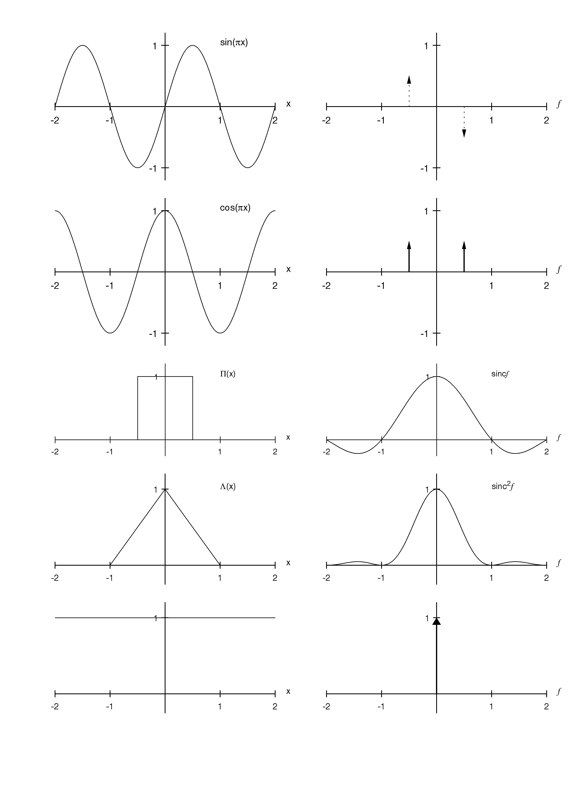
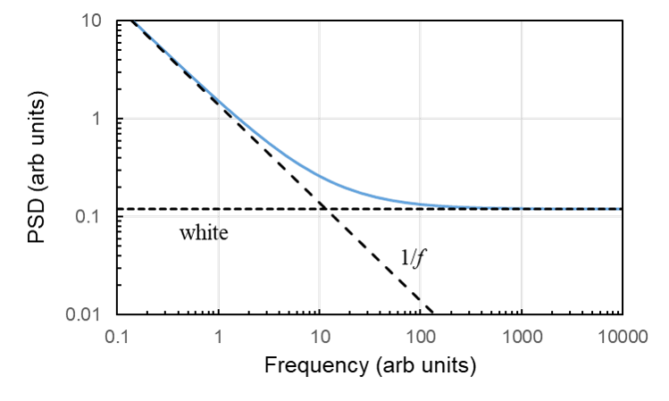

# Digital Sampling DIY Edition

## Objective

The primary objective of these experiments is to familiarize you with digital data acquisition of time-varying signals. This lab covers concepts in frequency analysis of time varying signals and sampling theory. It also provides an introduction to digital data acquisition (DAQ) systems. You wil use a personal DAQ to sample signals produced by waveforms stored in mp3 formats and converted to analog electrical signals. You will explore issues in: sampling, including the Nyquist limit and aliasing; filtering and its use for noise reduction; and digitization errors. You will also use your DAQ and a microphone to record and analyze sounds in an experiment chosen by you and a partner.

## Background

Most experimental measurements involve the dimension of **time**. Experimental data is acquired over the course of some time, and during this time the actual physical parameter of interest (the _**measurand**_) may change. This could be due to a transient, such as the stress induced in a material by a sudden impact, a periodic phenomena, like the bending and twist of a helicopter blade due to flutter, or random or chaotic fluctuations, like the turbulent velocity in a wind tunnel. Even when the measurand is nominally constant in time, other parameters that influence the measurement may vary, for example drifts in the measurement device. Thus, the experimenter is often interested in measuring a variable that can be described by the general function (or _**waveform**_),

$$
\large v=v(t)
$$

(1)

### Waveforms and Frequency Content&#x20;

#### Fourier Series

One of the simplest time-dependent functions we encounter is the sine (or cosine\*),


\*Either function is acceptable, since $$\sin(wt)=\cos(wt-\pi/2)$$, i.e., the two functions are identical except for a phase difference of π/2 or 90°, meaning that shifted by one-fourth of a cycle, cosine looks just like sine.


$$
\large v(t)=A\sin(\omega t+\phi)=A\sin(2\pi ft+\phi)
$$

(2)

where $$A$$ is the amplitude, $$\omega$$ is the circular frequency (e.g., rad/s), $$f$$is the cyclic frequency (e.g., cycles/s, Hertz or $$s^{-1}$$), and $$\phi$$ is the phase, which represents the time-shift of the sine-wave from some reference time that defines _t_=0. Such a function is often denoted as a _simple harmonic_ waveform.

More general periodic waveforms, which repeat themselves with a period _T_ and thus have a frequency $$f$$= 1_/T_, can be **written as a linear combination of simple harmonic** _**modes**_. There is the basic, _**fundamental**_ mode (with frequency$$f$$), and _**harmonics**_ of the fundamental mode, with integer multiples of its frequency (2$$f$$, 3$$f$$, …). For example, we could describe the vibrations of a tuning fork or the acoustic oscillations in a pipe this way. Mathematically, this linear combination of modes is expressed as a **Fourier series expansion**,

$$
\large v(t)=a_0+\sum_{n=1}^\infty\left[a_n\cos(2\pi nft)+b_n\sin(2\pi nft)\right]
$$

(3)

where $$nf$$ represents the frequency of the $$n^{th}$$ mode ($$n$$=1 for the fundamental, $$n$$=2 for the first harmonic, etc.), $$a_0$$ represents the steady component of the waveform, and the $$a_n$$, $$b_n$$ are the harmonic coefficients (or amplitudes) of each mode. The steady amplitude, $$a_0$$, is often called the DC component of the waveform, in reference to classical electrical power systems, which are either **D**irect **C**urrent (steady) or **A**lternating **C**urrent (sinusoidal with a zero average).

> **Figure 1.** A waveform composed of a fundamental mode (at 50 Hz) and its 9th harmonic (at 10 times the fundamental frequency, or 500 Hz). The waveform also has a DC, or time-averaged, component of 4 mV. Specifically, the signal (in millivolts) is 4+sin(100πt)+2sin(1000πt), or equivalently, based on cosines, 4+cos(100πt-π/2)+2cos(1000πt-π/2), which simply represents a phase shift of -π/2.

For example, Figure 1 shows a simple waveform composed of two frequencies, a fundamental mode at 50 Hz and its 9th harmonic. Thus the complete waveform is repeated every 20 ms (period=1/fundamental frequency =1/50 s). The waveform shown in the figure also has a DC component. In other words, the signal has a nonzero value when averaged over its period. In general, we can write the DC amplitude as

$$
\large a_0=\frac{1}{T}\int_{-T/2}^{T/2}v(t)dt=f\int_{-T/2}^{T/2}v(t)dt
$$

(4)

The other coefficients of the Fourier expansion are given by

$$
\large a_n=2f\int_{-T/2}^{T/2}v(t)\cos(2\pi nft)dt \\ \space \\ \space \\ b_n=2f\int_{-T/2}^{T/2}v(t)\sin(2\pi nft)dt
$$

(5)

and they can be combined into a complex number (since, $$e^{-ix}=\cos x-i\sin x$$),

$$
\large a_n-ib_n=2f\int_{-T/2}^{T/2}v(t)e^{-i2\pi nft}dt
$$

(6)

The _**power**_, $$P$$, contained in single mode is given by the square of the amplitude

$$
\large P(n)=a_{n}^{2}+b_{n}^{2}
$$

(7)

and the _**phase**_ $$\phi$$ (or phase angle) of a mode is given by

$$
\large \phi (n)=\tan^{-1}(b_n/a_n)
$$

(8)

A second example that shows the ability of a combination of sine waves to create an arbitrary periodic function is shown in Fig. 2. Five sine waves and a DC component (see Fig. 3) were combined to create a function approaching a square wave. While the constructed function resembles a square wave, it is clear that more sine waves would be needed to produce a sharp square wave.

> **Figure 2.** Partial reconstruction of a square wave using five sine waves, each with a different amplitude, frequency and phase, and a separate DC component. The individual waves are shown in Fig. 3.

> **Figure 3.** The five sine waves and constant function used to construct the square wave shown in Fig. 2.

#### Fourier Transforms

The procedure outlined above for periodic functions can be extended to general functions, which are not necessarily periodic, by considering any arbitrary function to be periodic with an infinitely long period. This approach leads to the **Fourier Transform**. Given a function $$v(t)$$, its Fourier Transform $$V(f)$$ is a complex function defined by

$$
\large V(f)=\int_{-\infty}^{\infty}v(t)e^{-i2\pi ft}dt
$$

(9)

in parallel to the complex Fourier function of equation (6). The function $$V(f)$$ represents the information given by $$v(t)$$ _**transformed from the time domain to the frequency domain**_. The transformation is nearly identical in the reverse direction, with simply a change in the phase (note the sign of the exponent), i.e.,

$$
\large v(t)=\int_{-\infty}^{\infty}V(f)e^{+i2\pi ft}df
$$

(10)

For example, Figure 4 graphically shows the Fourier transforms of various functions, including sine and cosine waves, a rectangle function (Π), a triangle function (Λ) and a constant, or DC, function. The sine, cosine and DC waveforms result in Fourier transforms that are nonzero at a single frequency\*\*;


\*\*The negative frequencies relate to phase information for the sine and cosine and do not actually represent different frequencies, i.e., for real functions $$v(t)$$ , it can be shown that $$|V(f)|=|V(-f)|$$. That means that if you take the absolute value of V, the part of V below 0 frequency looks like a reflection of the part for f>0.


in other words, they contain information at only one frequency (the DC function, which does not change in time, is associated with a frequency of zero). The Fourier transforms of the rectangle and triangle functions result in $$sinc$$ and $$sinc^2$$ functions, where $$sinc(f)=\sin(\pi f)/\pi f$$ , which contains information at many frequencies, but with multiple frequency “peaks”.

> **Figure 4.** Fourier transforms of various functions (left and right pairs). The arrows represent impulse functions (i.e., delta functions), which extend infinitesimally along the x-axis, but have a integrated area corresponding to the height indicated by the arrow. The dashed regions indicate imaginary values.

Instead of looking at the Fourier transform, we often are interested in the _**power spectrum**_ (or _**power spectral density,**_ **PSD**) of a waveform. This represents the amount of power or energy in a region between $$f$$ and $$f+df$$. For real (noncomplex) functions $$v(t)$$, this is given by

$$
\large PSD(f)=|V(f)|^2
$$

(11)

where it is sufficient to consider only 0<$$f$$<∞ since the PSD of a real function is symmetric about $$f$$=0.\*\*

Thus the PSD of the rectangle function, $$\Pi(x)$$ as shown in Figure 4, is the square of its Fourier transform, or $$sin c^2(f)$$ (also shown in Figure 4).

Extensions of the Fourier Transform method have been developed for non-continuous functions, specifically for signals that have been discretely sampled by a computer, data acquisition system, or produced by digital means. These are generally known as **Discrete Fourier Transforms**. In addition, methods to quickly compute the Fourier Transform have also been developed, e.g., the **Fast Fourier Transform**. These concepts are described in detail in References 2 and 4. The digital data acquisition system you will use employs these techniques to compute the power and phase spectra of the signals that are sampled in this lab.

#### Noise

Measured signals in ground experiments and flight tests (as well as other applications such as communications and controls) include noise from various sources. In the frequency domain, noise can have a very complicated structure. There are some simple noise models, however,  that can be appropriate in many situations. For example, **white noise** has a flat power spectrum, meaning it has the same power at every frequency over some wide range. Another type of noise observed in many systems, including electronics, music and many biological systems, is called **1/f noise** (or pink noise). In this case, the power spectrum (again over some wide frequency range) scales as the inverse of the frequency, i.e., the power of the noise at each frequency is inversely proportional to the frequency. Both of these types of noise can be observed at the same time (as well as other noise types). For example, Figure 5 shows a power spectrum (power spectral density, PSD vs frequency) with both 1/f and white noise components. Using these models, one can interpolate the noise at a frequency that has "real" signal, and estimate the **signal-to-noise ratio** (PSD of signal at a given frequency divided by the PSD of the estimated noise).

> **Figure 5.** Example noise spectrum consisting of a sum of white noise and 1/f noise (note log scaling of both axes).

### Sampling Theory and Aliasing

In most situations, especially for digital data acquisition, the continuous function $$v(t)$$ is sampled (i.e., the data is acquired) at evenly spaced, discrete intervals in time, separated by an amount $$\Delta t$$. The sampling frequency (or data acquisition rate) is thus $$f_s=1/\Delta t$$.

For a given sampling rate, we might ask how accurately the discretely acquired data can reproduce the actual waveform being sampled. The answer depends on the frequency content of the waveform and a special frequency, called the _**Nyquist frequency**_ $$(f_N)$$, which is half the sampling frequency, i.e., $$f_N=f_s/2$$. If the waveform contains no components above the Nyqist frequency, then the waveform can be completely determined by the sampled data (assuming no errors in the measurement).\*\*\* This is known as the _**Nyquist/Nyquist-Shannon Sampling Theorem**_.


\*\*\*A waveform that has information in only a limited range of frequencies is called **bandwidth limited**. Due to phase ambiguity, the sampling frequency should actually be more than twice the maximum frequency in the waveform. For example, a sine wave sampled at 0, $$\pi$$, $$2\pi$$, etc. would always have a 0 result and could be confused with a null function.


As a simple example, consider a single sine wave. If we know we are dealing with a single frequency sine wave, it takes at least two measurements per period to determine its frequency, which means we must sample at twice the sine wave’s frequency. If we sample any slower, we actually infer a lower frequency than the actual frequency of the sine wave (you will see this in the lab). This process, by which information at a higher frequency shows up at a lower frequency is known as _**aliasing**_**.**

Aliasing occurs for any sampled waveform having components with frequencies above the sampling system’s Nyquist frequency, i.e., $$(f>f_N)$$. One way to remove this problem is to filter the data before it is sampled. This can be accomplished by a low pass filter, a filter that only passes frequencies below some cut-off frequency. One would set the cut-off at or below the Nyquist frequency. The high frequency information is thus removed before it can be aliased. In essence, the filter produces a bandwidth limited waveform.

### Digital Data Acquisition Systems

Data will be acquired with a standalone digital data acquisition system (**DAQ**) that communicates with your computer through a USB connection and using a LabView™ software interface. Most DAQs can be connected to more than one input source; each signal (e.g., a voltage) is connected to one channel of the DAQ. A typical DAQ consists of a multiplexer, a sample-and-hold device, an amplifier, an analog-to-digital converter, a memory buffer, a microcontroller, and an interface to a computer (see Figure 6).

**Figure 6.** Schematic of multiplexed, sequential sampling, digital data acquisition system and its connection to a computer.=

The _**multiplexer**_** ** (MUX) is a switch that connects one of a number of input channels (usually numbered starting at 0) to the _**sample-and-hold**_** ** (S/H). The input voltage on the channel switched by the MUX “charges up” the sample-and-hold during some time interval, which is a fraction of the sampling period (the time between samples). This circuit is then disconnected from the input voltage, and some of the stored charge is drained from it. The amount of charge leaving during this time is proportional to the original input voltage. The output of the S/H is amplified and then converted to a digital value by the _**analog-to-digital converter**_** ** (ADC). The digital result is then moved to the buffer memory, and communicated to the computer.&#x20;

The digital value produced by the ADC (sometimes referred to as a “word” of data) depends not only on the input voltage, but also on the _**voltage range**_ and _**number of bits**_ of the ADC/amplifer system. The range is given by the _minimum_ and _maximum_ voltages that the ADC/amplifier can read (e.g., 0 and 5 V). The number of bits  ($$N$$) in the ADC determines its digital dynamic range (= $$2^N-1$$). Thus the relation between the digitizer output and the voltage input is given by

$$
\large output=\frac{input-minimum}{maximum-minimum}\times\left(2^N-1\right)
$$

(12)

where output has to be an _integer value_. As an example, for a 2.05 V input into a DAQ with a 0-10 V range, and an 8-bit digitizer (possible digital values of 0-255), the output value would be 52 (not 52.275). Any signal amplitude variations below the difference between two adjacent quantized levels are lost; this is known as the _**quantization error**_ =$$(maximum-minimum)/2^N$$. In the example above, we can only say the input value was 2.039V$$\pm$$0.0196 V (assuming the example ADC rounds rather than truncates). One would normally choose an ADC with a number of bits sufficiently high that the quantization error is less than the dominant sources of error in the measurement. Other factors, though, may influence the choice of ADC bits, including cost and data storage requirements, both of which increase with the added number of bits.&#x20;

Multiple signal inputs are recorded by using the MUX to cycle through each of the input channels at a rate that must be faster than the overall sampling rate (how often a given channel is read) times the number of input channels being read. In the sequential sampling system illustrated in Fig. 6 (and which is representative of the system you will be using), note that the channels are _not read at exactly the same time_. There is a time delay (**skew**) between when one channel and the next is read. The skew determined by the maximum switching and reading rates of the MUX, S/H and ADC. This is illustrated in Fig. 7. Simultaneous data acquisition systems, which have negligible skew, typically employ multiple, synchronized S/H systems just upstream of the MUX (see Fig. 8).

> **Figure 7.** Time delay (skew) between successive channels in sequential sampling system.
>
>

.png>)

> **Figure 8.** Schematic of simultaneous sampling, digital data acquisition system.

In this lab, you control the data acquisition process through a software interface called a LabView _virtual instrument_ (VI). The VI creates a display on the computer screen that lets you think of the data acquisition system as a box with “knobs”, “dials”, and other displays. For this experiment, the VI allows you to control parameters such as the minimum and maximum voltages read by the DAQ, the sampling rate$$(f_s)$$, and the number of samples recorded.

### Sampling/DAQ Terminology

The following terminology is commonly used in DAQ systems, and you should become familiar with these terms.

* **Sample** = a single measurement (i.e., at an "instant" in time) captured by the DAQ from one channel
* **Sampling period** = the time between two successive samples &#x20;
* **Sampling rate** = 1/sampling period, with typical units of Samples/sec (S/s) or Hz
* **Record** = a group of successive samples acquired by the DAQ&#x20;
* **Record length** = the number of samples in a record, typical units of Samples (S)
* **Record duration** = the time between the first and last sample in a record&#x20;

## Procedure

**Week 1**&#x20;

The following tasks should be accomplished during the lab.&#x20;

1. **Pickup DIY kit:**
   * _Labjack DAQ, USB cord, 3.5 mm audio jack cord_
   * _Microphone and cord_
   * _Watch video on components and connections_
2. **Download and software:**
   * Watch video on installing software and testing system
   * Download and install executable Labview VI&#x20;
   * Download mp3 tracks to your computer or mobile device
3. **Test your devices:**
   * Connect DAQ to computer using USB cable
   * Connect device audio output to DAQ using 3.5mm audio jack cable
   * Test your system - if you have trouble, ask TA for help

**Week 2**

At a minimum, you must complete the following tasks, but you are free to try other things to learn about digital data acquisition, sampling theory, and frequency content of signals. **Keep notes on what you observe or find as you do each task**.

You can work on this where ever and whenever you want (but before your regularly scheduled lab session). Also, you must **work on these task by yourself**. If you have trouble with the equipment or do not understand the required tasks, you can reach out to the TAs during office hours or using \_\_\_\_\_\_ (Canvas, Piazza???)

You will still attend your lab session at your regularly scheduled time, this week - BRING your DAQ/computer system with you. You will be asked to demonstrate certain things to the TAs and answer some questions based on having done these tasks and learned the underlying concepts. If you can not do the required tasks or successfully answer the TAs questions, you can work during the lab time to work on the material, and be re-assessed by the TAs when you think you are ready. You have an unlimited number of attempts to pass the assessment, but only until the lab session ends.

1. **Perform initial waveform identification**
   * There are 12 audio tracks. Each audio track contains a different periodic signal. These signals include: **single sine waves** (at different frequencies), a **sum of three sine waves** (each at a different frequency)**,** a **product of two sine waves** (e.g., sin(At) sin(Bt), also known as amplitude modulation), **a sine wave of a sine wave** (e.g., sin(sin(At), also known as frequency modulation), and periodic waveforms that are not sine waves: **square waves**, **triangle waves**, and **ramps**. Some tracks also have "noisy" versions of some of these waveforms.
   * Play each track on your device, listen to it
     * [ ] &#x20;Write down your guess for the waveform on each track (it is okay to guess wrong)&#x20;
2. **Setup DAQ system**
   * Connect DAQ to computer using USB cable
   * Connect audio output of the device you are using to play the tracks to the DAQ using the 3.5mm audio jack cable
   * Open the GTAESimpleDAQ.exe application
3. **Use DAQ to perform waveform identification**
   * &#x20;Start application (by hitting Run button)
   * Set the data acquisition and display parameters to:
     * Sampling rate = 25,000 S/s = 25 kS/s
     * Record length = 10,000 S
     * Autoscale = on (for all plot axes)&#x20;
     * All other settings should be okay based on the defaults when you start the application
   * Use your device to play one track at a time, in repeat mode
   * Observe the time plot and power spectrum; you should adjust the output/volume level to make sure most of the tracks have a peak voltage of a few volts)
     * _Tip: With the waveform displayed as you like, you can toggle the Continuous/Hold switch to the Hold position so that the display just shows the last data captured (doesn't keep taking new samples)_
       * [ ] Identify the waveform on each track
       * [ ] Compare these to your original guesses made by listening to the tracks (you may find it helpful to remove the 3.5 mm connector from your device and listen again to the tracks that you misidentified)&#x20;
       * [ ] For each track, write down the frequencies for each of the peaks you see in the power spectrum&#x20;
         * _Tip: you can turn the autoscale off on the Power Spectrum x-axis and set the axes limits to make it easier to find the frequency(s)_
4. **Examine complex waveforms and interpret power spectra**
   1. Play the track you identified as product of sines (**amplitude modulation**)&#x20;
      * [ ] From the time plot, determine the period of the wave (time between peaks)
        * _Tip: remember you can toggle the Continuous/Hold button if you want to freeze the display_&#x20;
      * [ ] Is the frequency of the waveform based on the period the same as any of the frequencies you wrote down from the power spectrum? If not, why?  &#x20;
        * _Hint: the power spectrum shows the frequencies needed to produce that signal from a **sum** of sines!!!_&#x20;
   2. Play the track you identified as the **triangle** wave
      * [ ] &#x20;__ From the time plot, again determine the period of the wave (time between peaks); how is it related to the frequencies you wrote down from the power spectrum?
   3. Alternate playing the **triangle** wave track and the **square** wave track
      * [ ] Compare the heights (power) of each peak in the power spectrum; which waveform has more power at high frequencies?&#x20;
      * [ ] Think of any reasons why that waveform should contain more high frequency content based on its shape
5. **Examine quantization error**
   * Play the track with the square wave, and make sure the settings are: _Continuous, Sampling Rate_=10,000_, Record Length_ = 1000,  all axes have _Autoscale=on_ except time plot, set maximum limit on time plot x-axis to 0.01 seconds
   * Observe both the time plot and power spectrum as you reduce the output volume on the device playing the tracks
     * [ ] What changes do you observe when the volume is set very low?
6. **Explore effects of record length and sampling rate on power spectrum**
   * Play the track containing the 1 kHz sine wave
   * Set the _Sampling Rate_ = 4000 S/s and the _Record Length_ = 4 S&#x20;
   * Make sure the power spectrum is set to Autoscale for both x and y axes
   * FIND:&#x20;
     * [ ] the number of discrete points in the power spectrum (not the number of actual frequencies in the signal, but how many individual points are in the power spectrum plot
       * _Hint:  the points are connected by straight line segments in the plot_
     * [ ] the **Frequency Resolution** (=the frequency spacing between two points in the power spectrum)
     * [ ] the highest frequency in the power spectrum (not the frequency with the highest power, but the last frequency at the right side of the plot); note: the lowest frequency in the power spectrum is always 0 Hz&#x20;
       * _Tip: It may help to toggle from Continuous to Hold to capture one record while you examine the power spectrum_
   * Repeat the above 3 FINDs for a few longer Record Lengths (always pick an even number of samples)
   * Set the _Sample Rate_=8000 S/s, _Record Length_=4 S and repeat the FINDs&#x20;
     * [ ] Calculate the Record Duration for each case, and compare it to the frequency resolution you found for that case; are they related?
7. **Observe aliasing**
   * Find and play the track containing the 3 sine waves
   * Set the _Sampling Rate_ = 5000 S/s, the _Record Length_ = 5000 S, and toggle the switch to Continuous acquisition
   * Set the _Autoscale_=off switch for the x-axis on the power spectrum, and set the maximum frequency on the power spectrum axis to be 11kHz&#x20;
   * Observe the 3 frequencies of the 3 peaks in the power spectrum
   * Increase the _Sampling Rate_ to 7500 S/s&#x20;
     * [ ] Observe any changes in the frequencies of the 3 peaks&#x20;
   * Continue increasing the _Sampling Rate_ until you get to at least 25,000 S/s &#x20;
     * [ ] As you do this, observe the locations of the peaks on the frequency axis&#x20;
8. **Examine noise**
   * Play the each of the two tracks you identified as sine waves with noise
     * [ ] What type of noise is present?
     * [ ] Estimate the the signal-to-noise ratio of the signal for each track. &#x20;
9. **Explore the implementation of a low pass filter**
   * Play the track containing the sum of three sine waves&#x20;
   * Set the _Sampling Rate_ = 22 kS/s and _Record Length_ = 1000 S
   * Set the _Spectrum Display Settings_=Amplitude-Log&#x20;
   * In the time plot, _Autoscale_=off for the x-axis and set the maximum on the axis to 0.005 s
     * _Tip: the number on the axis will show up as 0.01 because the display will round it to 2 decimal places, but the value really is 0.005s_&#x20;
   * Set the _Filter_ = on, select from the pull down menu _Low Pass,_ select from the next pull down menu _Butterworth_, __ set _Low Cutoff Frequency_ = 11,000 Hz by typing in the value
   * Paying attention to both the time plot and power spectrum of both filtered and unfiltered signals, keep reducing the cutoff frequency until you obtain a filtered signal that has eliminated the highest frequency sine wave
     * [ ] What cutoff frequency was required to achieve this?
     * [ ] Did the filtering impact either of the other two sine waves?
10. **Explore the use of a band pass filter to remove noise from a signal**
    * Play the track containing the noisy square wave
    * Set _Sampling Rate_ = 25 kS/s, _Record Length_ = 5000 S
    * Select _Bandpass_ from filter pulldown menu, make sure the filter type is still set to  _Butterworth_&#x20;
    * Adjust the low and high cutoff frequencies to try and "clean up" the square-wave by looking at the time plot
      * [ ] What cutoff frequencies did you use?
      * [ ] Were you able to create a clean square wave?
      * [ ] How did the filtering change the power spectrum?&#x20;
11. **Shutdown procedure**
    * When you are through, hit the _Quit_ button
    * Close the application&#x20;
    * If you are done using the DAQ please disconnect the cables from it before you transport or store it away

**Week 3**

After passing your in-lab assessment, you and your partner should meet and decide what experiment you want to perform with your DAQ/microphone systems. As part of that experiment, you will need to validate/test your microphone system.

more later

## Data to be Taken

### **For Week 2**

1. A copy of your notes taken while you were doing the required tasks (so handwritten notes or printed notes). The notes should contain the data, observations and answers to the questions posed in the Procedure section. Your notes do need to be legible, but there is no special format requirement. CAN WE DUMP THE REST OF WHAT IS BELOW?

### **For Week 3**

1. Something about the signal recorded from the DAQ vs the signal recorded from the microphone/speaker using a tone generator
2. Something about there own data
   * [ ] Designed bandpass filter range.
   * [ ] dBVrms values of both peaks before and after filtering.
   * [ ] All three screenshots taken of the LabView VI.

## **​Data Reduction**

1. CAN WE DUMP THIS TOO?

## **​Results Needed for Data Report**

**Note: This will be presented by your two-person team as an Oral Report, so you must follow instructions on how to prepare the Oral Report on the Canvas course page.**&#x20;

1. Will need to provide some requirements on what must be in Oral Report about Week 3 experiment

## **Further Reading**

1.  R. V. Churchill and J. W. Brown, _Fourier Series and Boundary Value Problems_, 3rd ed., McGraw-Hill, 1978.

    ​
2.  R. N. Bracewell, _The Fourier Transform and Its Applications_, 2nd ed., McGraw-Hill, 1978.

    ​
3.  T. G. Beckwith, R. D. Marangoni and J. H. Lienhard V, _Mechanical Measurements_, 5th ed., Addison-Wesley, 1995.

    ​
4. W. H. Press, S. A. Teukolsky, W. T. Vetterling and B. P. Flanner\_, Numerical Recipes - The Art of Scientific Computing\_, 2nd ed., Cambridge University Press, 1992.

**​**
