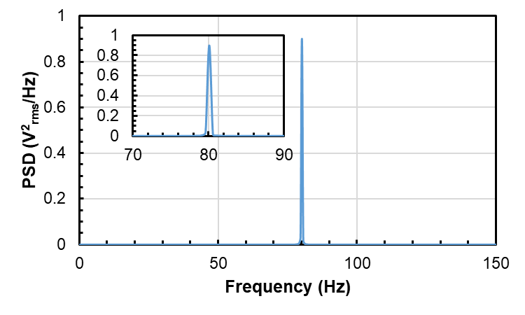

# Digital Sampling DIY Edition

## Objective

The primary objective of these experiments is to familiarize you with digital data acquisition of time-varying signals. This lab covers concepts in frequency analysis of time varying signals and sampling theory. It also provides an introduction to digital data acquisition (DAQ) systems. You wil use a personal DAQ to sample signals produced by waveforms stored in mp3 formats and converted to analog electrical signals. You will explore issues in: sampling, including the Nyquist limit and aliasing; filtering and its use for noise reduction; and digitization errors. You will also use your DAQ and a microphone to record and analyze sounds in an experiment chosen by you and a partner.

## Background

Most experimental measurements involve the dimension of **time**. Experimental data is acquired over the course of some time, and during this time the actual physical parameter of interest (the _**measurand**_) may change. This could be due to a transient, such as the stress induced in a material by a sudden impact, a periodic phenomena, like the bending and twist of a helicopter blade due to flutter, or random or chaotic fluctuations, like the turbulent velocity in a wind tunnel. Even when the measurand is nominally constant in time, other parameters that influence the measurement may vary, for example drifts in the measurement device. Thus, the experimenter is often interested in measuring a variable that can be described by the general function (or _**waveform**_),

$$
\large v=v(t) \tag{1}
$$

### Waveforms and Frequency Content&#x20;

#### Fourier Series

One of the simplest time-dependent functions we encounter is the sine (or cosine\*),


\*Either function is acceptable, since $$\sin(wt)=\cos(wt-\pi/2)$$, i.e., the two functions are identical except for a phase difference of π/2 or 90°, meaning that shifted by one-fourth of a cycle, cosine looks just like sine.


$$
\large v(t)=A\sin(\omega t+\phi)=A\sin(2\pi ft+\phi) \tag{2}
$$

where $$A$$ is the amplitude, $$\omega$$ is the circular frequency (e.g., rad/s), $$f$$is the cyclic frequency (e.g., cycles/s, Hertz or $$s^{-1}$$), and $$\phi$$ is the phase, which represents the time-shift of the sine-wave from some reference time that defines $$t = 0$$. Such a function is often denoted as a _simple harmonic_ waveform.

More general periodic waveforms, which repeat themselves with a period _T_ and thus have a frequency $$f = 1/T$$, can be **written as a linear combination of simple harmonic** _**modes**_. There is the basic, _**fundamental**_ mode (with frequency$$f$$), and _**harmonics**_ of the fundamental mode, with integer multiples of its frequency ($$2f$$, $$3f$$, …). For example, we could describe the vibrations of a tuning fork or the acoustic oscillations in a pipe this way. Mathematically, this linear combination of modes is expressed as a **Fourier series expansion**,

$$
\large v(t)=a_0+\sum_{n=1}^\infty\left[a_n\cos(2\pi nft)+b_n\sin(2\pi nft)\right] \tag{3}
$$

where $$nf$$ represents the frequency of the $$n^{th}$$ mode ($$n = 1$$ for the fundamental, $$n = 2$$ for the first harmonic, etc.), $$a_0$$ represents the steady component of the waveform, and the $$a_n$$, $$b_n$$ are the harmonic coefficients (or amplitudes) of each mode. The steady amplitude, $$a_0$$, is often called the DC component of the waveform, in reference to classical electrical power systems, which are either **D**irect **C**urrent (steady) or **A**lternating **C**urrent (sinusoidal with a zero average).

> **Figure 1.** A waveform composed of a fundamental mode (at 50 Hz) and its 9th harmonic (at 10 times the fundamental frequency, or 500 Hz). The waveform also has a DC, or time-averaged, component of 4 mV. Specifically, the signal (in millivolts) is $$4+ \sin(100\pi t) + 2\sin(1000\pi t)$$, or equivalently, based on cosines, $$4+ \cos(100\pi t - \pi/2) + 2\cos(1000\pi t - \pi/2)$$, which simply represents a phase shift of $$-\pi/2$$.

For example, Figure 1 shows a simple waveform composed of two frequencies, a fundamental mode at 50 Hz and its 9th harmonic. Thus the complete waveform is repeated every 20 ms (period=1/fundamental frequency =1/50 s). The waveform shown in the figure also has a DC component. In other words, the signal has a nonzero value when averaged over its period. In general, we can write the DC amplitude as

$$
\large a_0=\frac{1}{T}\int_{-T/2}^{T/2}v(t)dt=f\int_{-T/2}^{T/2}v(t)dt \tag{4}
$$

The other coefficients of the Fourier expansion are given by

$$
\begin{equation*} \tag{5} \begin{align*} \large a_n &= 2f\int_{-T/2}^{T/2}v(t)\cos(2\pi nft)dt  \\[20pt]  b_n &= 2f\int_{-T/2}^{T/2}v(t)\sin(2\pi nft)dt \end{align*} \end{equation*}
$$

and they can be combined into a complex number (since, $$e^{-ix}=\cos x-i\sin x$$),

$$
\large a_n-ib_n=2f\int_{-T/2}^{T/2}v(t)e^{-i2\pi nft}dt \tag{6}
$$

The _**power**_, $$P$$, contained in single mode is given by the square of the amplitude

$$
\large P(n)=a_{n}^{2}+b_{n}^{2} \tag{7}
$$

and the _**phase**_ $$\phi$$ (or phase angle) of a mode is given by

$$
\large \phi (n)=\tan^{-1}(b_n/a_n) \tag{8}
$$

A second example that shows the ability of a combination of sine waves to create an arbitrary periodic function is shown in Fig. 2. Five sine waves and a DC component (see Fig. 3) were combined to create a function approaching a square wave. While the constructed function resembles a square wave, it is clear that more sine waves would be needed to produce a sharp square wave.

> **Figure 2.** Partial reconstruction of a square wave using five sine waves, each with a different amplitude, frequency and phase, and a separate DC component. The individual waves are shown in Fig. 3.

> **Figure 3.** The five sine waves and constant function used to construct the square wave shown in Fig. 2.

#### Fourier Transforms

The procedure outlined above for periodic functions can be extended to general functions, which are not necessarily periodic, by considering any arbitrary function to be periodic with an infinitely long period. This approach leads to the **Fourier Transform**. Given a function $$v(t)$$, its Fourier Transform $$V(f)$$ is a complex function defined by

$$
\large V(f)=\int_{-\infty}^{\infty}v(t)e^{-i2\pi ft}dt \tag{9}
$$

in parallel to the complex Fourier function of equation (6). The function $$V(f)$$ represents the information given by $$v(t)$$ _**transformed from the time domain to the frequency domain**_. The transformation is nearly identical in the reverse direction, with simply a change in the phase (note the sign of the exponent), i.e.,

$$
\large v(t)=\int_{-\infty}^{\infty}V(f)e^{+i2\pi ft}df \tag{10}
$$

For example, Figure 4 graphically shows the Fourier transforms of various functions, including sine and cosine waves, a rectangle function (Π), a triangle function (Λ) and a constant, or DC, function. The sine, cosine and DC waveforms result in Fourier transforms that are nonzero at a single frequency\*\*;


\*\*The negative frequencies relate to phase information for the sine and cosine and do not actually represent different frequencies, i.e., for real functions $$v(t)$$, it can be shown that $$|V(f)|=|V(-f)|$$. That means that if you take the absolute value of V, the part of V below 0 frequency looks like a reflection of the part for $$f > 0$$.


in other words, they contain information at only one frequency (the DC function, which does not change in time, is associated with a frequency of zero). The rectangle and triangle functions shown are not repeating like the sine waves; the functions shown here represent "single pulses." The Fourier transforms of these single rectangle and triangle functions result in $$\text{sinc}$$ and $$\text{sinc}^2$$ functions, where $$\text{sinc}(f)=\sin(\pi f)/\pi f$$ , which contains information at many frequencies, but with multiple frequency “peaks”.

> **Figure 4.** Fourier transforms of various functions (left and right pairs). The arrows represent impulse functions (i.e., delta functions), which extend infinitesimally along the x-axis, but have a integrated area corresponding to the height indicated by the arrow. The dashed regions indicate imaginary values.

Instead of looking at the Fourier transform, we often are interested in the _**power spectrum**_ (or _**power spectral density,**_ **PSD**) of a waveform. This represents the amount of power or energy in a region between $$f$$ and $$f+df$$. For real (noncomplex) functions $$v(t)$$, this is given by

$$
\large PSD(f)=|V(f)|^2 \tag{11}
$$

where it is sufficient to consider only $$0 < f < \infty$$ since the PSD of a real function is symmetric about $$f = 0$$.\*\* Thus the PSD of the rectangle function, $$\Pi(x)$$ as shown in Figure 4, is the square of its Fourier transform, or $$\text{sinc}^2(f)$$ (also shown in Figure 4).

Extensions of the Fourier Transform method have been developed for non-continuous functions, specifically for signals that have been discretely sampled by a computer, data acquisition system, or produced by digital means. These are generally known as **Discrete Fourier Transforms (DFT)**, and a computationally efficient approach is known as the **Fast Fourier Transform (FFT)**. These concepts are described in detail in References 2 and 4. The digital data acquisition system you will use employs these techniques to compute power (and phase) spectra.

An example PSD is shown in Fig. 5 for an 80 Hz sine wave based on a DFT. Unlike the Fourier Transform of the sine wave in Fig. 4, the PSD for a sine wave is no longer infinitely thin, i.e., the DFT shows power spread over a small range of frequencies around 80 Hz. This occurs because the DFT has a limited **frequency resolution** (it can only report values at discrete frequencies).&#x20;

> **Figure 5.** PSD of an 80 Hz sine wave obtained with a DFT; with values sampled at 2 msec intervals; inset shows zoomed-in region around 80 Hz.&#x20;

​**Noise**

Measured signals in ground experiments and flight tests (as well as other applications such as communications and controls) include noise from various sources. In the frequency domain, noise can have a very complicated structure. There are some simple noise models, however,  that can be appropriate in many situations. For example, **white noise** has a flat power spectrum, meaning it has the same power at every frequency over some wide range. Another type of noise observed in many systems, including electronics, music and many biological systems, is called $$\bm{1/f}$$ **noise** (or pink noise). In this case, the power spectrum (again over some wide frequency range) scales as the inverse of the frequency, i.e., the power of the noise at each frequency is inversely proportional to the frequency. Both of these types of noise can be observed at the same time (as well as other noise types). For example, Fig. 6 shows a power spectrum (power spectral density, PSD vs frequency) with both $$1/f$$ and white noise components. Using these models, one can interpolate the noise at a frequency that has "real" signal, and estimate the **signal-to-noise ratio** (PSD of signal at a given frequency divided by the PSD of the estimated noise).

> **Figure 6.** Example noise spectrum consisting of a sum of white noise and $$1/f$$ noise (note log scaling of both axes).

### Sampling Theory and Aliasing

For most situations involving either computer generated or computer acquired data, the continuous function $$v(t)$$ is sampled at evenly spaced, discrete intervals in time, separated by an amount $$\Delta t$$. The sampling frequency (or data acquisition rate) is thus $$f_s=1/\Delta t$$.

For a given sampling rate, we might ask how accurately the discretely acquired data can reproduce the actual waveform being sampled. The answer depends on the frequency content of the waveform and a special frequency, called the _**Nyquist frequency**_ $$(f_N)$$, which is half the sampling frequency, i.e., $$f_N=f_s/2$$. If the waveform contains no components above the Nyqist frequency, then the waveform can be completely determined by the sampled data (assuming no errors in the measurement).\*\*\* This is known as the _**Nyquist/Nyquist-Shannon Sampling Theorem**_.


\*\*\*A waveform that has information in only a limited range of frequencies is called **bandwidth limited**. Due to phase ambiguity, the sampling frequency should actually be more than twice the maximum frequency in the waveform. For example, a sine wave sampled at $$0$$, $$\pi$$, $$2\pi$$, etc. would always have a 0 result and could be confused with a null function.


As a simple example, consider a single sine wave. If we know we are dealing with a single frequency sine wave, it takes at least two measurements per period to determine its frequency, which means we must sample at twice the sine wave’s frequency. If we sample any slower, we actually infer a lower frequency than the actual frequency of the sine wave (you will see this in the lab). This process, by which information at a higher frequency shows up at a lower frequency is known as _**aliasing**_**.**

Aliasing occurs for any sampled waveform having components with frequencies above the sampling system’s Nyquist frequency, i.e., $$(f>f_N)$$. One way to remove this problem is to filter the data before it is sampled. This can be accomplished by a low pass filter, a filter that only passes frequencies below some cut-off frequency. One would set the cut-off at or below the Nyquist frequency. The high frequency information is thus removed before it can be aliased. In essence, the filter produces a bandwidth limited waveform.

### Digital Data Acquisition Systems

Data will be acquired with a standalone digital data acquisition system (**DAQ**), LabJack™ T4, that communicates with your computer through a USB connection and using a LabVIEW™ software interface. Most DAQs can be connected to more than one input source; each signal (e.g., a voltage) is connected to one channel of the DAQ. A typical DAQ consists of a multiplexer, a sample-and-hold device, an amplifier, an analog-to-digital converter, a memory buffer, a microcontroller, and an interface to a computer (see Figure 7).

**Figure 7.** Schematic of multiplexed, sequential sampling, digital data acquisition system and its connection to a computer.

The _**multiplexer**_** ** (MUX) is a switch that connects one of a number of input channels (usually numbered starting at 0) to the _**sample-and-hold**_** ** (S/H). The input voltage on the channel switched by the MUX “charges up” the sample-and-hold during some time interval, which is a fraction of the sampling period (the time between samples). This circuit is then disconnected from the input voltage, and some of the stored charge is drained from it. The amount of charge leaving during this time is proportional to the original input voltage. The output of the S/H is amplified and then converted to a digital value by the _**analog-to-digital converter**_** ** (ADC). The digital result is then moved to the buffer memory, and communicated to the computer.&#x20;

The digital value produced by the ADC (sometimes referred to as a “word” of data) depends not only on the input voltage, but also on the _**voltage range**_ and _**number of bits**_ of the ADC/amplifer system. The range is given by the _minimum_ and _maximum_ voltages that the ADC/amplifier can read (e.g., 0 and 5 V). The number of bits  ($$N$$) in the ADC determines its digital dynamic range (= $$2^N-1$$). Thus the relation between the digitizer output and the voltage input is given by

$$
\large output=\frac{input-minimum}{maximum-minimum}\times\left(2^N-1\right) \tag{12}
$$

where output has to be an _integer value_. As an example, for a 2.05 V input into a DAQ with a 0-10 V range, and an 8-bit digitizer (possible digital values of 0-255), the output value would be 52 (not 52.275). Any signal amplitude variations below the difference between two adjacent quantized levels are lost; this is known as the _**quantization error**_ =$$(maximum-minimum)/2^N$$. In the example above, we can only say the input value was 2.039V$$\pm$$0.0196 V (assuming the example ADC rounds rather than truncates). One would normally choose an ADC with a number of bits sufficiently high that the quantization error is less than the dominant sources of error in the measurement. Other factors, though, may influence the choice of ADC bits, including cost and data storage requirements, both of which increase with the added number of bits.&#x20;

Multiple signal inputs are recorded by using the MUX to cycle through each of the input channels at a rate that must be faster than the overall sampling rate (how often a given channel is read) times the number of input channels being read. In the sequential sampling system illustrated in Fig. 6 (and which is representative of the system you will be using), note that the channels are _not read at exactly the same time_. There is a time delay (**skew**) between when one channel and the next is read. The skew is determined by the maximum switching and reading rates of the MUX, S/H and ADC. This is illustrated in Fig. 8. Simultaneous data acquisition systems, which have negligible skew, typically employ multiple, synchronized S/H systems just upstream of the MUX (see Fig. 9).

> **Figure 8.** Time delay (skew) between successive channels in sequential sampling system.
>
>

.png>)

> **Figure 9.** Schematic of simultaneous sampling, digital data acquisition system.

In this lab, you control the data acquisition process through a software interface called a LabVIEW _virtual instrument_ (VI). The VI creates a display on the computer screen that lets you think of the data acquisition system as a box with “knobs”, “dials”, and other displays. For this experiment, the VI allows you to control parameters such as the minimum and maximum voltages read by the DAQ, the sampling rate$$(f_s)$$, and the number of samples recorded.

### Sampling/DAQ Terminology

The following terminology is commonly used in DAQ systems, and you should become familiar with these terms.

* **Sample** = a single measurement (i.e., at an "instant" in time) captured by the DAQ from one channel
* **Sampling period** = the time between two successive samples &#x20;
* **Sampling rate** = 1/sampling period, with typical units of Samples/sec (S/s) or Hz
* **Record** = a group of successive samples acquired by the DAQ&#x20;
* **Record length** = the number of samples in a record, typical units of Samples (S)
* **Record duration** = the time between the first and last sample in a record&#x20;

## Procedure

### **Non-Windows Users**

The software for this lab currently only works on Windows, and cannot be made to work for Mac or any other OS this leaves Mac users with the following options that we have tested and verified:

* Use the in-built Bootcamp software (Intel chip and Windows license key required)
* Install and use Parallels ($39.99 student license, Windows license key required)&#x20;
* Borrow a Windows machine

#### Borrowing from the library

If you don't have the ability to borrow a Windows machine from a peer, you will need to check out a loaner Windows laptop from the library. Follow this guidance:

* Library laptops can only be checked out for **4 hours** at a time. However, they can be renewed at the library for another 4 hours once per day.
* GT-OIT has programmed the machines to fully reset to their nominal state if it is shut down or restarted. Therefore, ignore any instructions to restart the machine after software installation. Instead, select **RESTART LATER.**
* When you return the laptop to the library but immediately check out again to extend your time, try and check back out the same machine, else you will need to repeat the installation.
* Remember to send yourself any saved data before returning the laptop.
* Once you've acquired the laptop, follow the instructions below as normal.

### **Week 1**&#x20;

The following tasks should be accomplished _**during**_ the lab. The intention of this lab is to make sure you verify all items in your kit functions correctly and that you have a basic understanding of how they function.&#x20;

1. **Kit preparation:**
   * Obtain a Digital Sampling kit from your TAs
   * Check that the contents of your kit match the box label; if not, obtain any replacement parts from a TA
   * Register your LabJack T4 serial number with your TAs
2. **Software preparation:**
   * Go to the [LabJack software installation page ](https://labjack.com/support/software/installers/ljm)and download the "Release" version for your operating system
   * Run the installer and follow all steps to install in your preferred location
   * Download and unzip the GTAE Simple DAQ installation files ([found in the Software and Files section below](./#software-and-files))
   * Run the installer and follow all steps to install in your preferred location
   * Restart your machine
3. **Verify your LabJack T4 DAQ functions correctly:**
   * Connect your LabJack T4 DAQ to your computer using the provided USB cable
   * Open LabJack's Kipling software that was just installed, and connect to the T4 by clicking on the green USB button (refresh devices if it wasn't found)
     * <mark style="color:yellow;">!!! NOTE - If your search bar doesn't find it, navigate to Kipling under the LabJack folder after pressing the Windows Start icon !!!</mark>
   * Go to the Dashboard tab, where you will see a schematic of the T4 with live display of the inputs and output pins. Perform the following "loopback" tests to make sure your DAQ is functioning correctly:
     1. By default, AIN0 to AIN3 should be reading around 1.4V&#x20;
     2. With one of the jumper wires and larger screwdriver from your kit, connect AIN0 to a nearby GND pin; the AIN0 voltage should now go to around 0V (the pin is being pulled to ground)
     3. Now connect AIN0 to VS (supply voltage); since VS is coming from your USB port you should be reading around 5.1V
     4. Now set DAC0 and DAC1 to 2 different voltages less than 5V (DAC means Digital-to-Analog-Converter i.e. these pins are analog voltage outputs); connect AIN0 to each of them, verifying that the measured voltages match the output voltages
   * Disconnect wire and close Kipling
4. **Verify your peripherals function correctly**:
   * Ensure your T4 is plugged in
   * Open GTAE Simple DAQ, choose a save data folder, and the application should now be running. <mark style="color:orange;">**!!! NOTE - Sometimes the SimpleDAQ will throw an error on startup or mid-acquisition. If this happens, restart the software and power cycle (unplug and plug back in) the DAQ !!!**</mark>
   * If your monitor is clipping the edges of SimpleDAQ, try adjusting the display resolution and scaling (zoom) until it fits. In Windows this is done by right-clicking on the Desktop and selecting 'Display Settings'. If no options work for you, try plugging in an external monitor.
   * Turn on Autoscale for both axes of both plots; Time History and Power Spectrum. You should now see a real time plot of channel AIN0 with a voltage of around 1.4V plus or minus a small amount of noise
   * Test your 3.5mm audio breakout adapter:
     * Retrieve the breakout adapter and, with one jumper wire, connect its L terminal to your DAQ's AIN0 port (note that you may need to open up the screw terminal on the DAQ before being able to insert the wire)
     * With another wire, connect the ground terminal (far right) to your DAQ's GND port (the one next to AIN0)
     * Ensure you have good wired connections by **gently** tugging on them to ensure they don't come loose. Be careful not to bend the pins as they can snap fairly easily.
     * Plug the audio breakout into your laptop/tablet/smartphone (any device that can play audio and access YouTube).
       * _In Windows you will likely get a popup asking which device you just plugged in. Here you should select whichever option gives the best signal quality with low noise/distortion... this should be done iteratively and using your best judgement_.
     * Ensure that your operating system is set to play over the headphone jack (i.e. not your bluetooth headphones or in-built speakers).
     * Set the YouTube video player to maximum volume and your device volume to roughly 50%
     * Go to YouTube and find a "human hearing test" video [such as this one](https://youtu.be/H-iCZElJ8m0)
     * With the video playing, observe what's happening in GTAE Simple DAQ; you should see a sine wave of increasing frequency both in the time history and as a shifting spike in the power spectrum that should match that shown in the YouTube video (until around 11  kHz when it will start to diverge)
     * Adjust your device volume to observe the shifting amplitude of the signal
     * Once you have verified correct functionality after a minute or two (don't play the whole video), stop the video, unplug the audio adapter and remove the wires from the adapter (don't remove them from the DAQ)
   * Test your microphone:
     * <mark style="color:red;">**!!! WARNING - the microphone has bare electronics on the back of the board which can result in damage if shorted with a metal tool or surface; be sure to handle carefully and away from metal when powered !!!**</mark>
     * Retrieve the microphone and micro screwdriver from your kit
     * Connect the GND port of the microphone to the GND port on your DAQ which should already have a wire connected (note that you may need to open up the screw terminal on the microphone before being able to insert the wire)
     * Connect the OUT port of the microphone to the AIN0 port on your DAQ which should already have a wire connected
     * Connect the VCC port of the microphone to the VS port of the DAQ with a new wire
     * You should now see a rough waveform in GTAE Simple DAQ centered around roughly 2.5V. To stop the time history jumping around so much, turn off Y-Axis Autoscale and set the scale's maximum and minimum directly. Do this by double-clicking on the highest and lowest and numbers on the axis (6V and 0V might be a good start but adjust as necessary)
     * Test the microphone by generating some sounds of interest such as whistles, taps on the desk, talking, playing a tone from headphones, etc. Don't get the microphone too close to the noise source, it is quite sensitive. Bear in mind there will be lots of background noise so you may want to go somewhere quiet.
     * Once you are satisfied the microphone is functioning correctly, unplug the DAQ, remove all wires from all terminals, and neatly pack everything back up into the box.
5. **Before leaving the lab, understand the objectives and resources for the next 2 weeks:**
   1. Read the following steps in this manual that outline what you must have completed prior to each lab session. Check with your TAs if you are unsure of anything.
   2. A more in-depth explanation of GTAE Simple DAQ is given [at its dedicated webpage](https://gtae.gitbook.io/experimental/daq/gtae-simpledaq), including a short video on how to use the software.&#x20;
   3. The [LabJack website](https://labjack.com/products/t4) is a great resource for understanding more about how the DAQ works, and what you can do with it.&#x20;

### **Prior to Week 2**

By Week 2 lab, at a minimum, you must complete the following tasks, but you are free to try other things to learn about digital data acquisition, sampling theory, and frequency content of signals. **Keep notes on what you observe or find as you do each task**.

You can work on this where ever and whenever you want (but before your regularly scheduled lab session). Also, you must **work on these task by yourself**. If you have trouble with the equipment or do not understand the required tasks, you can reach out to the TAs during office hours or using Piazza.

You will still attend your lab session at your regularly scheduled time, this week - **bring your DAQ/computer system with you**. You will be asked to demonstrate certain things to the TAs and answer some questions based on having done these tasks and learned the underlying concepts. If you can not do the required tasks or successfully answer the TAs questions, you can work during the lab time to work on the material, and be re-assessed by the TAs when you think you are ready. You have an unlimited number of attempts to pass the assessment, but only until the lab session ends.


Waveforms for identification


1. **Perform initial audible waveform identification**
   * Directly above this list are 12 one-minute-long audio tracks collated into a single YouTube video. Each audio track contains a different periodic signal. These signals include: **single sine waves** (at different frequencies), a **sum of three sine waves** (each at a different frequency)**,** a **product of two sine waves** (e.g., sin(_At_) x sin(_Bt_), also known as amplitude modulation), **a sine wave of a sine wave** (e.g., sin(sin(_At)_), also known as frequency modulation), and periodic waveforms that are not sine waves: **square waves**, **triangle waves**, and **ramps**. Some tracks also have "noisy" versions of some of these waveforms.
   * Play the video and, for each track on your device, listen to it and write down your guess for the waveform on each track (it is okay to guess wrong)&#x20;
2. **Setup DAQ system**
   * Following the steps from Week 1, configure your DAQ and 3.5mm audio breakout adapter so that your laptop/tablet/PC/smartphone can capture the waveforms in the above YouTube video <mark style="color:red;">**!!! WARNING - Some devices (usually PCs/laptops) do not have good sound cards, resulting in significant distortion of the waveform. You will know this is happening if you don't recognize any square/triangle/ramp waveforms in the subsequent steps, and even the sine waves have significant distortion. If this occurs, switch to a device designed more for sound playing such as a smartphone or tablet (check with other members of your group or friends if you don't have one). You could also download the tracks and import them to an MP3 player. If all else fails, contact a TA who will help you find an appropriate device !!!**</mark>
   * In GTAE Simple DAQ, set the following settings:
     * _Sampling rate_ = 25,000 S/s
     * _Record length_ = 1,000 S
     * _Autoscale_ = initially ON for all axes (you will need to turn this off to adjust the time scale to "zoom in" during waveform identification)
     * All other settings should be okay based on the defaults when you start the application
3. **Use DAQ to perform waveform identification**
   * &#x20;Click Run to start&#x20;
   * Play the YouTube video linked above. You will inevitably run out of time for each track as you only have a minute on each, so click back within the window as necessary.
   * For each track, observe the time plot and power spectrum (adjust the output/volume level as required to see the waveforms clearly)
     * _Tip: With the waveform displayed as you like, you can toggle the Continuous/Hold switch to the Hold position so that the display just shows the last data captured (doesn't keep taking new samples)_
       * [ ] Identify the waveform on each track
       * [ ] Compare these to your original guesses made by listening to the tracks (you may find it helpful to remove the 3.5 mm connector from your device and listen again to the tracks that you misidentified)&#x20;
       * [ ] For each track, write down the frequencies for each of the peaks you see in the power spectrum&#x20;
         * _Tip: you can turn the autoscale off on the Power Spectrum x-axis and set the axes limits to make it easier to find the frequency(s)_
4. **Examine complex waveforms and interpret power spectra**
   1. Play the track you identified as product of sines (**amplitude modulation**)&#x20;
      * [ ] From the time plot, determine the period of the wave (time between peaks)
        * _Tip: remember you can toggle the Continuous/Hold button if you want to freeze the display_&#x20;
      * [ ] Is the frequency of the waveform based on the period the same as any of the frequencies you wrote down from the power spectrum? If not, why?  &#x20;
        * _Hint: the power spectrum shows the frequencies needed to produce that signal from a **sum** of sines!!!_&#x20;
   2. Play the track you identified as the **triangle** wave
      * [ ] &#x20;__ From the time plot, again determine the period of the wave (time between peaks); how is it related to the frequencies you wrote down from the power spectrum?
   3. Alternate playing the **triangle** wave track and the **square** wave track
      * [ ] Compare the heights (power) of each peak in the power spectrum; which waveform has more power at high frequencies?&#x20;
      * [ ] Think of any reasons why that waveform should contain more high frequency content based on its shape
5. **Examine quantization error**
   * Play the track with the square wave, and make sure the settings are: _Continuous, Sampling Rate_ = 10,000_, Record Length_ = 1000,  all axes have _Autoscale=on_ except time plot, set maximum limit on time plot x-axis to 0.01 seconds
   * Observe both the time plot and power spectrum as you reduce the output volume on the device playing the tracks
     * [ ] What changes do you observe when the volume is set very low?
6. **Explore effects of record length and sampling rate on power spectrum**
   * Play the track containing the 1 kHz sine wave
   * Set the _Sampling Rate_ = 4000 S/s and the _Record Length_ = 4 S&#x20;
   * Make sure the power spectrum is set to _Autoscale_ for both x and y axes
   * FIND:&#x20;
     * [ ] the number of discrete points in the power spectrum (not the number of actual frequencies in the signal, but how many individual points are in the power spectrum plot
       * _Hint:  the points are connected by straight line segments in the plot_
     * [ ] the **Frequency Resolution** (= the frequency spacing between two points in the power spectrum)
     * [ ] the highest frequency in the power spectrum (not the frequency with the highest power, but the last frequency at the right side of the plot); Note: the lowest frequency in the power spectrum is always 0 Hz&#x20;
       * _Tip: It may help to toggle from Continuous to Hold to capture one record while you examine the power spectrum_
       * _Tip: If you have trouble reading off the screen - you can also save the spectrum to a file and read frequency values from it - look at Step 3 in Week 3 on how to use the Save File Options_
   * Repeat the above 3 FINDs for a few longer Record Lengths (keep the number of samples low, less than 16 and always pick an even number of samples)
   * Set the _Sample Rate_ = 8000 S/s, _Record Length_ = 4 S and repeat the FINDs&#x20;
     * [ ] Calculate the Record Duration for each case, and compare it to the frequency resolution you found for that case; are they related?
7. **Observe aliasing**
   * Find and play the track containing the 3 sine waves
   * Set the _Sampling Rate_ = 5000 S/s, the _Record Length_ = 5000 S, and toggle the switch to Continuous acquisition
   * Set the _Autoscale_=off switch for the x-axis on the power spectrum, and set the maximum frequency on the power spectrum axis to be 11kHz&#x20;
   * Observe the 3 frequencies of the 3 peaks in the power spectrum
     * [ ] Are they the same 3 frequencies you saw when you played this track previously?
   * Increase the _Sampling Rate_ to 7500 S/s&#x20;
     * [ ] Observe any changes in the frequencies of the 3 peaks&#x20;
   * Continue increasing the _Sampling Rate_ until you get to at least 25,000 S/s &#x20;
     * [ ] As you do this, observe the locations of the peaks on the frequency axis&#x20;
8. **Examine noise**
   * Set the _Sampling Rate_ = 5000 S/s, the _Record Length_ = 5000 S, and toggle the switch to Continuous acquisition&#x20;
   * Play each of the two tracks you identified as sine waves with noise
     * [ ] What type of noise is present?
     * [ ] Estimate the signal-to-noise ratio of the signal for each track. &#x20;
9. **Explore the implementation of a low pass filter**
   * Play the track containing the sum of three sine waves&#x20;
   * Set the _Sampling Rate_ = 22,000 S/s and _Record Length_ = 1000 S
   * Set the _Spectrum Display Settings_ = Amplitude-Log&#x20;
   * In the time plot, _Autoscale_ = off for the x-axis and set the maximum on the axis to 0.005 s
   * Set the _Filter_ = on, select from the pull-down menu _Low Pass,_ select from the next pull-down menu _Butterworth_, __ set _Low Cutoff Frequency_ = 11,000 Hz by typing in the value
   * Paying attention to both the time plot and power spectrum of both filtered and unfiltered signals, keep reducing the cutoff frequency until you obtain a filtered signal that has eliminated the highest frequency sine wave
     * [ ] What cutoff frequency was required to achieve this?
     * [ ] Did the filtering impact either of the other two sine waves?
10. **Explore the use of a band pass filter to remove noise from a signal**
    * Play the track containing the noisy square wave
    * Set _Sampling Rate_ = 25 kS/s, _Record Length_ = 5000 S
    * Select _Bandpass_ from filter pulldown menu, make sure the filter type is still set to  _Butterworth_&#x20;
    * Adjust the low and high cutoff frequencies to try and "clean up" the square-wave by looking at the time plot
      * [ ] What cutoff frequencies did you use?
      * [ ] Were you able to create a clean square wave?
      * [ ] How did the filtering change the power spectrum?&#x20;
11. **Shutdown procedure**
    * When you are through, hit the _Quit_ button
    * Close the application&#x20;
    * If you are done using the DAQ please disconnect the cables from it before you transport or store it away

### **During Week 2 lab**

**Assessment TBD**

### **Prior to Week 3**

After passing your Week 2 in-lab assessment, you and your partner should meet and decide what experiment(s) you want to perform with your DAQ/microphone system. You will want to find something that interests your team, but also allows you to explore some interesting issues regarding the frequency content or frequency analysis of your signals. So for your experiment, there are no procedures supplied.

However, as part of this experiment - like any real-world test or experiment, you will need to first **validate/characterize your equipment - in this case the microphone system**. The idea is to measure how well the microphone responds at various frequencies. The following procedure describes this latter process.

1. **Setup Tone Generator**
   * Find a device (computer, tablet, etc.) with a wired audio output jack
   * Locate any online **Tone Generator** app on the web
     * _Hint: a Tone Generator will output a sine wave of a single frequency on the audio channel of your device_
   * Set the volume on the Tone Generator app to at least 75% of maximum&#x20;
2. **Setup DAQ**&#x20;
   * Connect DAQ to the computer using the USB cable
   * Connect audio output of the device you are using to play the Tone Generator to the DAQ using the 3.5mm audio jack and jumper wires
   * Open the GTAESimpleDAQ.exe application
   * Start application (by hitting Run button)
3. **Record and save single tone output**
   * Use the Tone Generator to output a tone at 200 Hz
   * Set the _Sampling Rate_ and _Record Length_ to appropriate values&#x20;
   * Set the _Continuous/Hold_ button to Hold to capture a record of this tone   &#x20;
   * In the window titled _Data Saving_, enter a filename in the _Filename_ text box, then click on the _Power Spectrum Save_ button
     * _Tip: the data will be saved in a subfolder called Saved Data in the folder you had open when you started the application; also the filename will have a date-time-stamp appended on the end_
     * _Tip: do not include a file extension in your file, it will be saved as a ".txt" file_
4. **Repeat Step 3 for at least 9 more tone frequencies ranging from 20 Hz to 10,000 Hz**
5. **Setup DAQ/microphone**
   * Remove 3.5mm audio jack and jumper wires from both your device and the DAQ
   * Connect three jumper wires to the screw terminal on the microphone and to the GND, VS and AIN0 input connections on the DAQ (as instructed in the video you watched)
6. &#x20;**Record microphone data**
   * Use the Tone Generator to play each tone frequency from Steps 3 and 4 through your device's speakers
   * For each tone, record the microphone output with the DAQ using the same sampling setting used for that tone in Steps 3-4
   * Save the record for each tone by first entering a filename in the _Filename_ text box (or you can use the name already there), then click on the _Power Spectrum Save_ button&#x20;

### During Week 3 lab

1. **Return equipment to the lab**
   * Disconnect the jumper wires from the microphone and DAQ, and the jumper wires from the 3.5mm audio jack
   * Carefully replace all the equipment (including wires and screwdrivers) in the original DIY kit box
   * Return your DIY kit box to the lab at your designated lab time during Week 3

&#x20;

## Data to be Taken

### **For Week 2**

1. Notes taken while you were doing the required tasks (so handwritten notes or digital notes). The notes should contain the data, observations and answers to the questions posed in the Procedure section. Your notes do need to be legible, but there is no special format requirement.&#x20;

### For Week 3

1. Time histories and power spectra at 10 (or more) single frequencies (from a Tone Generator) recorded by connecting the audio output of the computer device directly to the DAQ.
2. Time histories and power spectra at the same single frequencies as in Item 1, but recorded by playing them through the device speakers and capturing them with the microphone connected to the DAQ.
3. Appropriate data for the team's own experiment.

## **​Data Reduction**

### For Week 3

1. From your data taken in Week 3: Items 1 and 2 of the Data to be Taken section, calculate the relative response of the microphone-speaker system (power from microphone at each tone frequency divided by power at same tone frequency recorded from direct connection to DAQ).
2. Whatever data reduction is appropriate for your team's experiment.

## **​Results Needed for Oral Report**

**Note: This will be presented by your two-person team as an Oral Report, so you must follow instructions on how to prepare the Oral Report on the Canvas course page.**&#x20;

1. Plot of the relative response of the microphone(-speaker) system as a function of frequency.
2. Results you obtain from the experiment you designed.

## **Further Reading**

1.  R. V. Churchill and J. W. Brown, _Fourier Series and Boundary Value Problems_, 3rd ed., McGraw-Hill, 1978.

    ​
2.  R. N. Bracewell, _The Fourier Transform and Its Applications_, 2nd ed., McGraw-Hill, 1978.

    ​
3.  T. G. Beckwith, R. D. Marangoni and J. H. Lienhard V, _Mechanical Measurements_, 5th ed., Addison-Wesley, 1995.

    ​
4. W. H. Press, S. A. Teukolsky, W. T. Vetterling and B. P. Flanner\_, Numerical Recipes - The Art of Scientific Computing\_, 2nd ed., Cambridge University Press, 1992.

## Software and Files

### GTAE SimpleDAQ

Navigate to the [software release folder here](https://gtvault-my.sharepoint.com/:f:/g/personal/lwhitcher3\_gatech\_edu/Ehdcou3ZwTtHkTg-GSmOt4MBTMHbgwIERucGrJikIp8cPw?e=dgkIkg), logging in with your GT credentials, and download the correct version for your operating system. You can also download and use the LabView source files but you will need a full LabView install on your machine for this.

### Waveform files


Waveform Tracks

